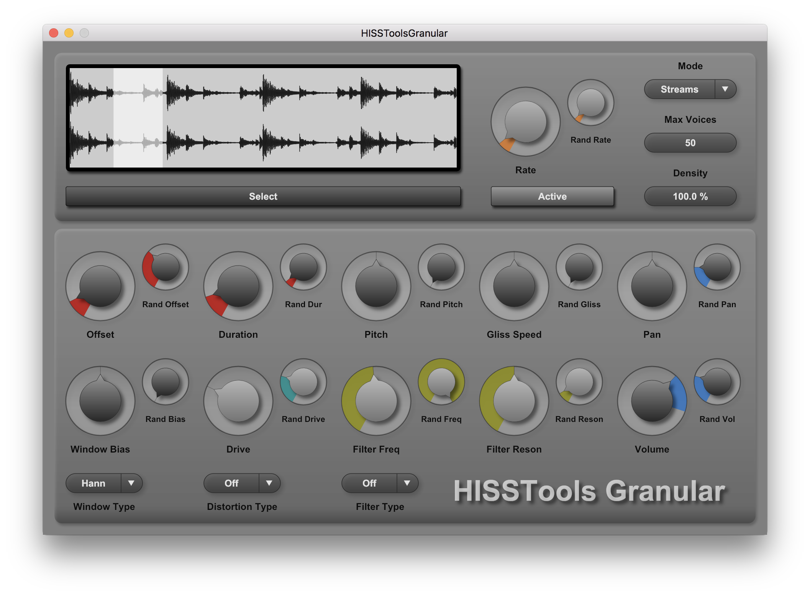

HISSTools Granular
========



HISSTools Granular is a lightweight plugin for granular synthesis based on samples.
* HISSTools Granular was originally built for teaching purposes at the University of Huddersfield.
* It supports the generation of grains in either 'streams' or 'clouds' modes.
* It allows per-grain distortion and filtering, as well as giving control of more common granular synthesis parameters.
* A full manual can be found [here](https://github.com/AlexHarker/HISSTools_Granular/blob/main/manual/HISSTools_Granular_User_Guide.pdf).

Formats / OS:
---------------------------------
- HISSTools Granular is curently provided as AUv2 (mac only) and VST2 / VST3 (mac / windows).
- Other formats are support by iPlug 2 but not yet configured to build correctly.

To Install the Plugin:
---------------------------------
- Automated builds of the plugin can be found on the [releases](https://github.com/AlexHarker/HISSTools_Granular/releases) page of GitHub (the latest version is at the top).
- If you do not **need** to build from source you are strongly advised to download the official builds linked above, rather than to download the source code / repository available directly from the frontpage of the repo on GitHub.

To Build the Plugin:
---------------------------------
- You will require a fully setup version of [iPlug 2](https://github.com/iPlug2/iPlug2).
- This repo is designed to be placed in a subfolder of the iPlug 2 repository (e.g. iPlug2/Projects).
- The [HISSTools_PlugiLib](https://github.com/AlexHarker/HISSTools_PluginLib) repo is also required to be placed next to this one before building (e.g. iPlug2/Projects).
- You will need to make sure that the HISSTools_Library submodule is correctly initialised (which can be done with ```git submodule update --init``` if you have already pulled the repository and you did not pull in a manner that already handled this).
- The supplied Xcode workspace and Visual Studio solution should then build the valid plugin formats (AUv2 / VST2 / VST3) correctly.

HISSTools Granular Makes Use Of:
---------------------------------

- **iPlug 2** - a C++ audio plug-in framework for desktop, mobile (iOS) and web <br>
https://github.com/iPlug2/iPlug2

- **HISSTools_PluginLib** - Common code that provides UI controls /  DSP for all HISSTools plugins<br>
https://github.com/AlexHarker/HISSTools_PluginLib

- **HISSTools_Library** - a C++ library for DSP (included as a submodule) <br>
https://github.com/AlexHarker/HISSTools_Library

Credits
---------------------------------
**HISSTools Granular** by *Alex Harker* <br>
CeReNeM - The University of Huddersfield

Contact:
---------------------------------

* ajharker@gmail.com
